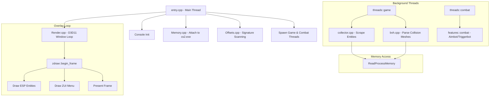

# Catalyst — External CS2 Overlay Utility

Catalyst is a high-performance, read-only external overlay and gameplay utility designed for Counter-Strike 2 (`cs2.exe`). Developed in modern C++23, it utilizes dynamic memory scanning, hardware-accelerated Direct3D 11 rendering, and runtime offset resolution to deliver features while maintaining a strictly local and non-intrusive runtime profile.

---

## 🚀 Key Features

### 🎯 Combat Assistance (Legitbot)
* **Aimbot:** Predictive aim adjustment with configurable FOV, smoothing settings, visible-only filters, autowall damage calculation, and hotkey activation.
* **Triggerbot:** Auto-fire helper with hitchance calculation, customizable pre-shot delay, predictive trace, and autowall verification.
* **Zeusbot:** Dedicated automatic helper for close-quarters taser usage.
* **Penetration Crosshair:** Real-time crosshair indicator showing whether your currently active weapon can penetrate the wall you are looking at and inflict damage.

### 👁️ Visuals (ESP Overlay)
* **Player ESP:** Supports cornered/full bounding boxes, dynamic skeleton rendering, interactive player hitboxes (capsule outlines), health/ammo status bars, player details (name, active weapon text/icon, money, armor, kit, scoped, defusing, flashed status).
* **Item ESP:** Highlights weapons, armor, utility, and grenades dropped on the ground, including current ammo count and custom filters.
* **Projectile ESP:** Renders in-flight grenade paths, timer bars for active smoke/molotovs, and boundaries for active incendiary fire zones.

### 💣 Grenade Trajectory Simulation
* Real-time physics simulation of grenade paths prior to throwing, modeling bounces, gravity scales, velocity inheritance, and detonation locations mapped via the game's loaded collision meshes.

### ⚙️ Engine & Architecture
* **Direct3D 11 Overlay:** Fully transparent hardware-accelerated overlay window with precise timing and optional frame-rate limiting.
* **SVG VPK Parser:** Reads game asset directories (`pak01_dir.vpk`) dynamically at runtime to load and decompile weapon/item icons directly from official vector game files.
* **Registry-Based Configurations:** Save, load, import, and export compressed configuration profiles stored locally under `HKEY_CURRENT_USER\Software\catalyst\configs`.

---

## 🛠️ Architectural Design & Implementation

The application is structured into discrete layers to isolate memory operations from rendering and feature logic:

---

## 🔄 Dynamic Offset Resolution (Auto-Updating)

Catalyst is engineered to withstand game updates without requiring manual offset offsets adjustments or code rebuilds:

1. **Pattern Scanning:** During initialization, the memory manager searches the process memory space of `client.dll` for precompiled byte sequences (signatures). When found, it resolves relative instructions (RIP) to dynamically locate structures like `entity_list` or the `view_matrix`.
2. **Schema System Scraper:** At startup, Catalyst query-scrapes the game engine's internal reflection schema system (`CSchemaSystem` in `schemasystem.dll`). This dynamically resolves the exact member variable offsets (e.g., health, armor, active weapons) at runtime.

---

## 🔒 Security Audit & Posture

A strict security audit of the codebase confirms the following:
* **No Outbound Traffic:** Catalyst is completely local. It does not link to `ws2_32.dll` or net/web interfaces. No network traffic is initiated.
* **Read-Only Memory Profile:** Operating as an external process, it opens a handle to `cs2.exe` requesting only `PROCESS_VM_READ` and `PROCESS_QUERY_INFORMATION` privileges. It does **not** write to the game's memory space, reducing the security and detection footprint.
* **No Persistent Spawning:** The application has no auto-start mechanisms or system process execution features (`CreateProcess` or `ShellExecute` are completely absent).

---

## 📂 Codebase Map

* [entry.cpp](file:///D:/Projects/windows/catalyst/catalyst/project/entry.cpp): Application startup, console initialization, process attachment, and thread management.
* [stdafx.hpp](file:///D:/Projects/windows/catalyst/catalyst/project/stdafx.hpp): Precompiled header declarations and global helper structures.
* [core/](file:///D:/Projects/windows/catalyst/catalyst/project/core): Core program modules.
  * [settings.hpp](file:///D:/Projects/windows/catalyst/catalyst/project/core/settings.hpp): Configuration settings data types and bindings.
  * [threads/](file:///D:/Projects/windows/catalyst/catalyst/project/core/threads): Execution loops for combat ticks and entity collectors.
  * [render/](file:///D:/Projects/windows/catalyst/catalyst/project/core/render): Direct3D 11 rendering window setup, font registration, and draw loop hooks.
  * [systems/](file:///D:/Projects/windows/catalyst/catalyst/project/core/systems): Game parsing systems (entities, schema scraper, VPK icon reader, BVH collision meshes).
  * [features/](file:///D:/Projects/windows/catalyst/catalyst/project/core/features): Legitbot (aim/trigger), ESP (player/item/grenades), and grenade physics code.
* [utilities/](file:///D:/Projects/windows/catalyst/catalyst/project/utilities): Utility classes.
  * [memory/](file:///D:/Projects/windows/catalyst/catalyst/project/utilities/memory): Handle scanner, Rip resolver, and `ReadProcessMemory` abstractions.
  * [input/](file:///D:/Projects/windows/catalyst/catalyst/project/utilities/input): Direct input emulation using resolved `NtUserInjectMouseInput`/`NtUserInjectKeyboardInput` handles.
  * [console/](file:///D:/Projects/windows/catalyst/catalyst/project/utilities/console): Thread-safe gradient logger and system console utility.

---

## 💻 Building the Project

### Prerequisites
* Windows 10 or Windows 11
* Visual Studio 2022 (v143 or newer build toolchain)
* C++23 standard library support

### Compilation Steps
1. Open the solution file `catalyst.slnx` or `catalyst/catalyst.vcxproj` in Visual Studio 2022.
2. Select **Release** configuration and **x64** target platform.
3. Build the solution (`Ctrl + Shift + B`).
4. The output binary will be compiled to the `../bin/` directory.
